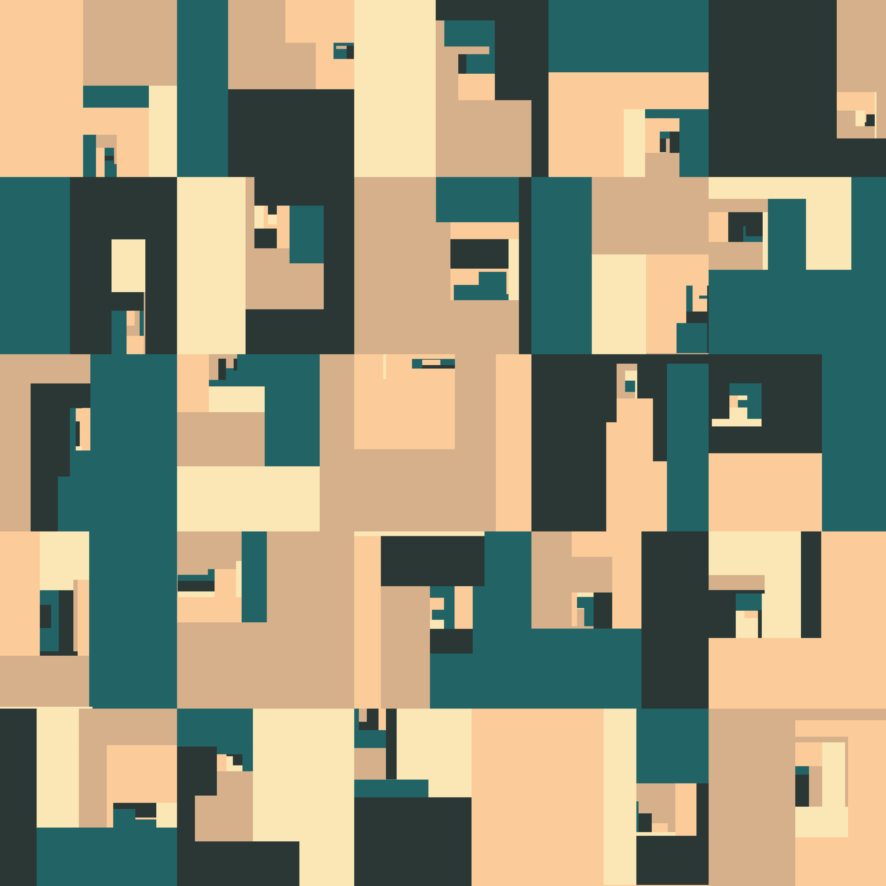
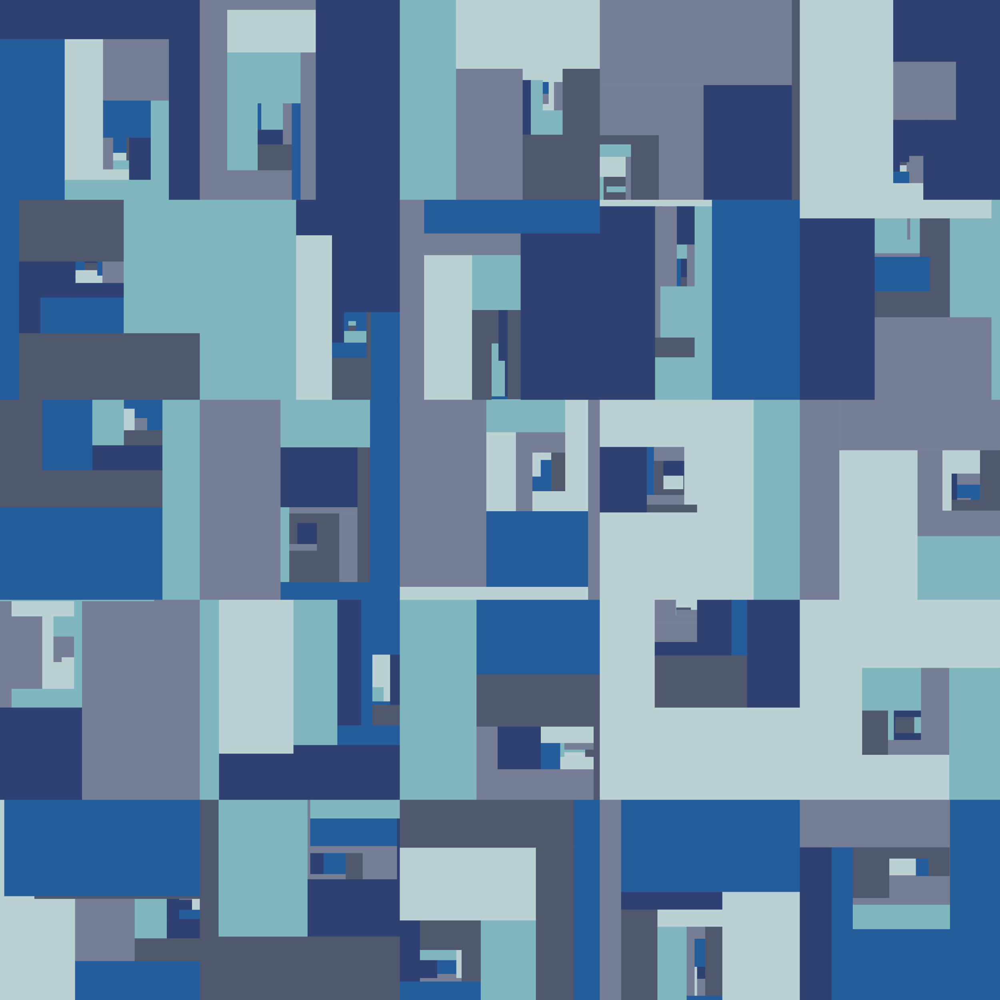

# BinaryTreeTassellation

A tiny package that draws pretty binary tilings.

## Installation

To install the package to your local machine, you can use Julia's package manager [Pkg.jl](https://github.com/JuliaLang/Pkg.jl).
Start a Julia REPL, and run
``` 
    ] add https://github.com/vittorioerba/BinaryTreeTassellation.jl
```
## Motivation

I wrote this code for the following reasons:
1) to try to implement a custom type in Julia for the first time. I basically implemented a binary tree structure with some additional components;
2) to try to package my code properly into a Julia package;
2) to start delving into the beautiful world of generative art. See [r/generative](https://reddit.com/r/generative).

## Examples




## Thanks to

- [Inspiration](https://generated.space/sketch/apparatus-3/)
- [Color schemes](https://www.schemecolor.com)
